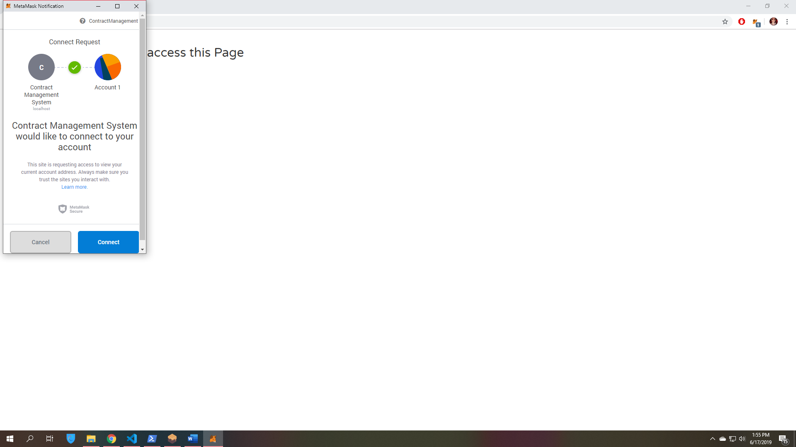
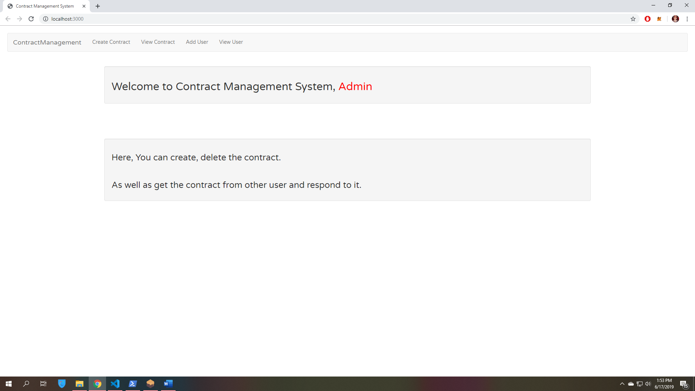
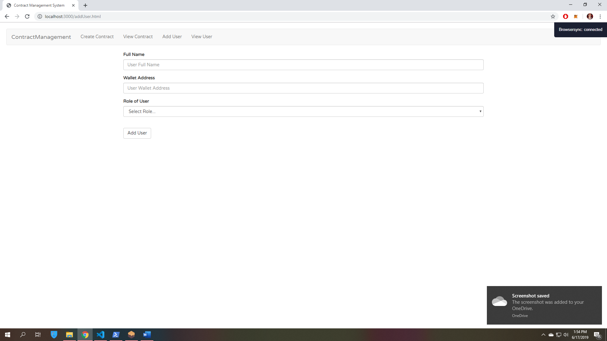
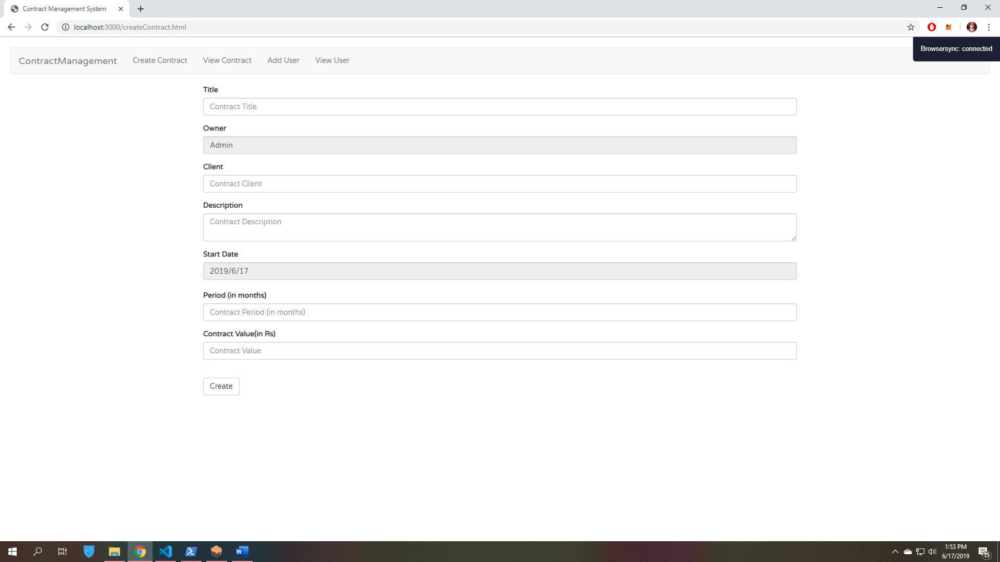
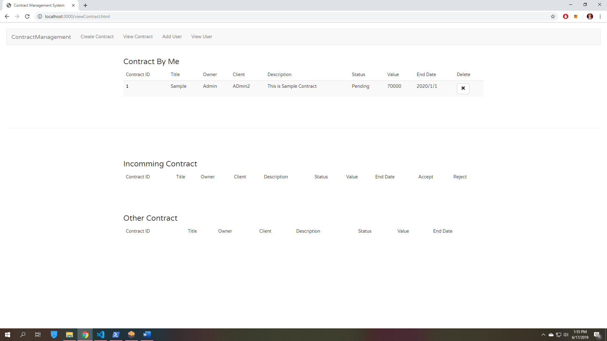

# BlockChain Contract Management System
 
 
 
 DEPENDENCIES:

1. NPM: https://nodejs.org
2. Truffle: https://github.com/trufflesuite/truffle
3. Ganache: http://truffleframework.com/ganache/
4. Metamask: https://metamask.io/
 
 
 
 STEPS TO RUN:
 
 1. Clone the project
 2. Open terminal and change directory to this folder.
 3. Install dependencies 
        <b>npm install</b>
 4. Start Ganache
 5. Compile and Deploy Project  
        <b>truffle migrate / <i>truffle migrate --reset</i> </b>(for re deploying the code)
 6. Configure MetaMask
 5. Run the DAPP  
        <b>npm run dev</b>  Visit this URL in your browser: http://localhost:3000

SCREENSHOT:

1. Connect to MetaMask

2. Landing Page

3. Creating User

4. Creating Contract

5. Viewing Contract

6. Viewing User

